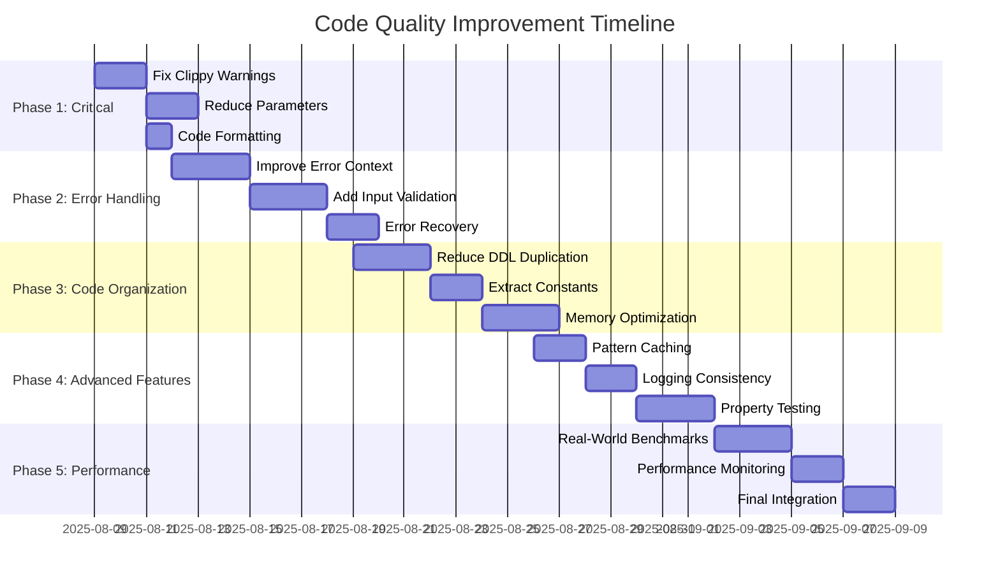

# Code Quality Improvement Plan for file2ddl

**Date**: August 8, 2025
**Based on**: Comprehensive code review findings
**Current Status**: Phase 4 complete with 29 unit + 9 integration tests (all passing)
**Code Quality Score**: A- (85/100)

## Executive Summary

The file2ddl application has solid architecture and functionality. This plan addresses code quality improvements identified in the recent code review to elevate the codebase from "excellent" to "exceptional" quality.

## Improvement Phases

### **Phase 1: Critical Issues (Week 1)**
*Target: Fix blocking issues identified by linters*

#### 1.1 Fix Clippy Warnings
**File**: `src/analyzer/inference.rs:229`
**Issue**: Inefficient map iteration
**Priority**: P0 - Blocks CI/CD pipeline

```rust
// Current
for (_i, analyzer) in &self.analyzers {

// Target
for analyzer in self.analyzers.values() {
```

**Acceptance Criteria**:
- [ ] All clippy warnings resolved
- [ ] `cargo clippy --all-targets --all-features` passes cleanly
- [ ] No performance regression in benchmarks

#### 1.2 Reduce Function Parameter Count
**File**: `src/analyzer/optimized.rs:23`
**Issue**: 9 parameters exceed Rust best practices (max 7)
**Priority**: P0 - Code maintainability

```rust
// Current: 9 parameters
pub fn analyze_file(
    &mut self,
    file_path: &str,
    delimiter: u8,
    quote: Option<u8>,
    null_values: Vec<String>,
    date_format: Option<String>,
    time_format: Option<String>,
    datetime_format: Option<String>,
    max_errors: usize,
) -> Result<Vec<ColumnStats>>

// Target: Configuration struct
pub struct AnalysisConfig {
    pub delimiter: u8,
    pub quote: Option<u8>,
    pub null_values: Vec<String>,
    pub date_format: Option<String>,
    pub time_format: Option<String>,
    pub datetime_format: Option<String>,
    pub max_errors: usize,
}

impl Default for AnalysisConfig {
    fn default() -> Self {
        Self {
            delimiter: b',',
            quote: Some(b'"'),
            null_values: vec!["".to_string(), "NULL".to_string()],
            date_format: None,
            time_format: None,
            datetime_format: None,
            max_errors: 100,
        }
    }
}

pub fn analyze_file(&mut self, file_path: &str, config: AnalysisConfig) -> Result<Vec<ColumnStats>>
```

**Acceptance Criteria**:
- [ ] Function parameter count ≤ 7 for all functions
- [ ] Configuration struct implements `Default` and `Clone`
- [ ] All existing tests pass without modification
- [ ] Configuration struct has comprehensive documentation

#### 1.3 Code Formatting Compliance
**Issue**: Multiple formatting violations found
**Priority**: P0 - Code consistency

**Tasks**:
- [ ] Run `cargo fmt` to fix all formatting issues
- [ ] Add pre-commit hook for formatting checks
- [ ] Update CI pipeline to enforce formatting
- [ ] Document formatting standards in CONTRIBUTING.md

**Acceptance Criteria**:
- [ ] `cargo fmt -- --check` passes cleanly
- [ ] All code follows consistent Rust formatting standards

### **Phase 2: Error Handling & Validation (Week 2)**
*Target: Improve robustness and user experience*

#### 2.1 Improve Error Context
**File**: `src/parser/streaming.rs:13`
**Issue**: Silent error fallbacks without user notification
**Priority**: P1 - User experience

```rust
// Current - silent fallback
let max_bad_rows = if args.badmax == "all" {
    None
} else {
    Some(args.badmax.parse::<usize>().unwrap_or(100))
};

// Target - proper error handling
let max_bad_rows = if args.badmax == "all" {
    None
} else {
    Some(args.badmax.parse::<usize>()
        .with_context(|| format!("Invalid badmax value: '{}'. Expected 'all' or positive integer", args.badmax))?)
};
```

**Acceptance Criteria**:
- [ ] All `.unwrap()` and `.unwrap_or()` calls replaced with proper error handling
- [ ] Error messages provide clear guidance to users
- [ ] Error contexts include relevant input values
- [ ] Integration tests verify error message quality

#### 2.2 Add Input Validation
**File**: `src/cli/mod.rs`
**Issue**: No validation of CLI inputs
**Priority**: P1 - Data integrity

**Implementation**:
```rust
fn validate_delimiter(s: &str) -> Result<char, String> {
    let c = s.chars().next().ok_or("Delimiter cannot be empty")?;
    if s.len() > 1 {
        return Err("Delimiter must be a single character".to_string());
    }
    if c.is_alphanumeric() {
        return Err("Alphanumeric delimiters may cause parsing issues".to_string());
    }
    if c.is_whitespace() && c != '\t' {
        return Err("Whitespace delimiters (except tab) are not recommended".to_string());
    }
    Ok(c)
}

fn validate_encoding(s: &str) -> Result<String, String> {
    match encoding_rs::Encoding::for_label(s.as_bytes()) {
        Some(_) => Ok(s.to_string()),
        None => Err(format!("Unsupported encoding: '{}'. Common encodings: utf-8, latin1, windows-1252", s))
    }
}
```

**Acceptance Criteria**:
- [ ] All CLI inputs validated before processing
- [ ] Helpful error messages for invalid inputs
- [ ] Support for `--help` shows validation rules
- [ ] Unit tests for all validation functions

#### 2.3 Enhanced Error Recovery
**File**: `src/analyzer/inference.rs`
**Issue**: Limited error recovery in streaming analysis
**Priority**: P2 - Resilience

**Implementation**:
```rust
pub struct ErrorRecoveryConfig {
    pub max_parse_errors: usize,
    pub max_type_errors: usize,
    pub continue_on_encoding_errors: bool,
    pub error_sampling_rate: f64, // 0.0-1.0, for large files
}

pub fn analyze_with_recovery(&mut self, config: ErrorRecoveryConfig) -> AnalysisResult {
    // Enhanced error handling with detailed recovery statistics
}
```

**Acceptance Criteria**:
- [ ] Configurable error recovery strategies
- [ ] Detailed error reporting with statistics
- [ ] No data loss during error recovery
- [ ] Performance impact < 5% for normal cases

### **Phase 3: Code Organization & Performance (Week 3-4)**
*Target: Improve maintainability and optimize performance*

#### 3.1 Reduce Code Duplication in DDL Generation
**File**: `src/analyzer/mod.rs:129-175`
**Issue**: Three nearly identical DDL generation functions
**Priority**: P2 - Maintainability

**Implementation**:
```rust
pub trait DdlFormatter {
    fn format_type(&self, sql_type: &SqlType) -> String;
    fn format_column(&self, name: &str, sql_type: &SqlType, nullable: bool) -> String;
    fn format_table_header(&self, table_name: &str) -> String;
    fn format_table_footer(&self) -> String;
}

pub struct PostgresDdlFormatter;
pub struct MySqlDdlFormatter;
pub struct NetezzaDdlFormatter;

// Generic function replacing 3 specialized ones
fn print_ddl<T: DdlFormatter>(table_name: &str, stats: &[ColumnStats], formatter: &T) -> Result<()> {
    println!("{}", formatter.format_table_header(table_name));
    
    for (i, stat) in stats.iter().enumerate() {
        let column_name = sanitize_column_name(&stat.name);
        let nullable = stat.is_nullable();
        let comma = if i == stats.len() - 1 { "" } else { "," };
        
        println!("    {}{}", 
            formatter.format_column(&column_name, &stat.sql_type, nullable), 
            comma);
    }
    
    println!("{}", formatter.format_table_footer());
    Ok(())
}
```

**Acceptance Criteria**:
- [ ] Single generic DDL generation function
- [ ] Trait-based database-specific formatting
- [ ] All existing DDL outputs remain identical
- [ ] Easy to add new database dialects
- [ ] Code coverage maintained at >90%

#### 3.2 Extract Constants to Configuration
**Files**: Multiple files with hardcoded constants
**Issue**: Magic numbers scattered throughout codebase
**Priority**: P2 - Configuration management

**Implementation**:
```rust
// src/config/mod.rs
#[derive(Debug, Clone, serde::Deserialize)]
pub struct AnalyzerConfig {
    pub max_sample_values: usize,
    pub max_unique_values: usize,
    pub varchar_size_threshold: usize,
    pub buffer_size: usize,
    pub progress_report_interval: usize,
    pub categorical_threshold: f64,
    pub cardinality_threshold: f64,
}

impl Default for AnalyzerConfig {
    fn default() -> Self {
        Self {
            max_sample_values: 10,
            max_unique_values: 1000,
            varchar_size_threshold: 4000,
            buffer_size: 8192,
            progress_report_interval: 10000,
            categorical_threshold: 0.1,
            cardinality_threshold: 0.95,
        }
    }
}

// Configuration file support
impl AnalyzerConfig {
    pub fn from_file<P: AsRef<Path>>(path: P) -> Result<Self> {
        let content = fs::read_to_string(path)?;
        let config = toml::from_str(&content)?;
        Ok(config)
    }
}
```

**Acceptance Criteria**:
- [ ] All magic numbers extracted to configuration
- [ ] Support for TOML configuration files
- [ ] Environment variable override support
- [ ] Configuration validation with helpful errors
- [ ] Documentation for all configuration options

#### 3.3 Optimize Memory Usage with Bloom Filters
**File**: `src/analyzer/column.rs:55`
**Issue**: Unbounded unique value storage can cause memory issues
**Priority**: P3 - Memory efficiency

**Implementation**:
```rust
use bloomfilter::Bloom;

pub struct ColumnAnalyzer {
    stats: ColumnStats,
    inferencer: TypeInferencer,
    null_values: HashSet<String>,
    unique_values: HashSet<String>,
    unique_bloom: Bloom<String>,     // Approximate cardinality
    config: AnalyzerConfig,
    // ... other fields
}

impl ColumnAnalyzer {
    fn analyze_value(&mut self, value: &str, row_number: usize) {
        // Use bloom filter for large datasets
        if self.unique_values.len() >= self.config.max_unique_values {
            if !self.unique_bloom.check(value) {
                self.unique_bloom.set(value);
            }
        } else {
            self.unique_values.insert(value.to_string());
            self.unique_bloom.set(value);
        }
        // ... rest of analysis
    }
    
    fn get_approximate_cardinality(&self) -> usize {
        if self.unique_values.len() < self.config.max_unique_values {
            self.unique_values.len()
        } else {
            self.unique_bloom.number_of_hash_functions() // Approximate
        }
    }
}
```

**Dependencies to add**:
```toml
[dependencies]
bloomfilter = "1.0"
```

**Acceptance Criteria**:
- [ ] Memory usage capped for high-cardinality columns
- [ ] Cardinality estimation accuracy within 5% for test datasets
- [ ] Performance improvement for files with >1M unique values
- [ ] Configurable bloom filter parameters

### **Phase 4: Advanced Features & Testing (Week 5)**
*Target: Add advanced capabilities and comprehensive testing*

#### 4.1 Add Caching for Pattern Matching
**File**: `src/analyzer/patterns.rs:88`
**Issue**: Repeated regex evaluation on similar patterns
**Priority**: P3 - Performance optimization

**Implementation**:
```rust
use lru::LruCache;
use std::sync::RwLock;

pub struct TypeInferencer {
    date_format: String,
    time_format: String,
    datetime_format: String,
    true_values: Vec<String>,
    false_values: Vec<String>,
    type_cache: RwLock<LruCache<String, SqlType>>,
}

impl TypeInferencer {
    pub fn new() -> Self {
        Self {
            // ... existing fields
            type_cache: RwLock::new(LruCache::new(std::num::NonZeroUsize::new(1000).unwrap())),
        }
    }
    
    pub fn infer_type(&self, value: &str) -> SqlType {
        let trimmed = value.trim();
        
        // Check cache first
        if let Ok(cache) = self.type_cache.read() {
            if let Some(cached_type) = cache.peek(trimmed) {
                return cached_type.clone();
            }
        }
        
        // Perform expensive type inference
        let inferred_type = self.infer_type_uncached(trimmed);
        
        // Cache result
        if let Ok(mut cache) = self.type_cache.write() {
            cache.put(trimmed.to_string(), inferred_type.clone());
        }
        
        inferred_type
    }
}
```

**Dependencies to add**:
```toml
[dependencies]
lru = "0.12"
```

**Acceptance Criteria**:
- [ ] 20%+ performance improvement on datasets with repeated patterns
- [ ] Cache hit rate >80% for typical CSV files
- [ ] Thread-safe caching implementation
- [ ] Configurable cache size limits

#### 4.2 Improve Logging Consistency
**Files**: Multiple files with inconsistent logging
**Issue**: Mixed logging approaches reduce debugging effectiveness
**Priority**: P2 - Developer experience

**Implementation**:
```rust
// Structured logging throughout
use log::{debug, info, warn, error};
use serde_json::json;

// Replace mixed logging patterns with structured logging
debug!(target: "type_inference", 
    "{}",
    json!({
        "event": "type_promotion",
        "column": self.stats.name,
        "from_type": self.stats.sql_type.to_string(),
        "to_type": promoted_type.to_string(),
        "row": self.current_row,
        "value": value,
        "reason": "pattern_mismatch"
    })
);

// Performance metrics logging
info!(target: "performance",
    "{}",
    json!({
        "event": "analysis_complete",
        "duration_ms": start.elapsed().as_millis(),
        "rows_processed": self.row_count,
        "columns": self.headers.len(),
        "errors": self.error_count,
        "throughput_rows_per_sec": (self.row_count as f64 / start.elapsed().as_secs_f64()).round()
    })
);
```

**Dependencies to add**:
```toml
[dependencies]
serde_json = "1.0"
```

**Acceptance Criteria**:
- [ ] All logging uses structured format
- [ ] Performance metrics automatically collected
- [ ] Log levels properly configured (debug/info/warn/error)
- [ ] JSON log format for production environments

#### 4.3 Add Property-Based Testing
**Files**: All test modules
**Issue**: Limited test coverage of edge cases
**Priority**: P3 - Test quality

**Implementation**:
```rust
// tests/property_tests.rs
use proptest::prelude::*;

proptest! {
    #[test]
    fn type_inference_never_panics(data in ".*{0,1000}") {
        let inferencer = TypeInferencer::new();
        let _ = inferencer.infer_type(&data); // Should never panic
    }
    
    #[test]
    fn csv_parsing_handles_arbitrary_input(
        rows in prop::collection::vec(".*{0,100}", 0..1000),
        delimiter in r"[,|\t;]",
    ) {
        let csv_data = rows.join(&format!("\n"));
        // Should handle without panicking
        let result = std::panic::catch_unwind(|| {
            // Test CSV parsing logic
        });
        assert!(result.is_ok());
    }
    
    #[test]
    fn type_promotion_is_associative(
        types in prop::collection::vec(arbitrary_sql_type(), 2..10)
    ) {
        // Test that type promotion order doesn't matter
        let mut result1 = types[0].clone();
        for t in &types[1..] {
            result1 = result1.promote(t);
        }
        
        let mut result2 = types.last().unwrap().clone();
        for t in types.iter().rev().skip(1) {
            result2 = t.promote(&result2);
        }
        
        // Results should be equivalent (commutative property)
        assert_eq!(result1, result2);
    }
}

fn arbitrary_sql_type() -> impl Strategy<Value = SqlType> {
    prop_oneof![
        Just(SqlType::Boolean),
        Just(SqlType::SmallInt),
        Just(SqlType::Integer),
        Just(SqlType::BigInt),
        Just(SqlType::DoublePrecision),
        Just(SqlType::Date),
        Just(SqlType::Time),
        Just(SqlType::DateTime),
        (1usize..1000).prop_map(|n| SqlType::Varchar(Some(n))),
        Just(SqlType::Varchar(None)),
    ]
}
```

**Acceptance Criteria**:
- [ ] Property-based tests for all critical algorithms
- [ ] No panics discovered in 10,000 random test cases
- [ ] Type system mathematical properties verified
- [ ] Integration with existing test suite

### **Phase 5: Advanced Performance & Monitoring (Week 6)**
*Target: Production readiness and observability*

#### 5.1 Add Real-World Benchmarks
**File**: `benches/real_world_datasets.rs`
**Issue**: Benchmarks don't reflect real usage patterns
**Priority**: P3 - Performance validation

**Implementation**:
```rust
// benches/real_world_datasets.rs
use criterion::{black_box, criterion_group, criterion_main, BenchmarkId, Criterion, Throughput};

fn bench_real_world_datasets(c: &mut Criterion) {
    let datasets = vec![
        ("wide_table", create_wide_csv(1000, 100)),      // Many columns
        ("long_table", create_long_csv(100000, 5)),      // Many rows
        ("mixed_types", create_mixed_type_csv(10000)),   // Complex inference
        ("high_cardinality", create_high_card_csv(5000)), // Memory pressure
        ("unicode_heavy", create_unicode_csv(1000)),     // Encoding complexity
    ];
    
    let mut group = c.benchmark_group("real_world");
    
    for (name, csv_content) in datasets {
        let size_bytes = csv_content.len() as u64;
        group.throughput(Throughput::Bytes(size_bytes));
        
        group.bench_with_input(
            BenchmarkId::new("analyze", name),
            &csv_content,
            |b, content| {
                b.iter(|| {
                    let mut engine = StreamingInferenceEngine::new(
                        vec![], None, None, None, 1000, false
                    );
                    let cursor = std::io::Cursor::new(content);
                    black_box(engine.analyze_csv_reader(cursor, b',', Some(b'"')).unwrap())
                });
            },
        );
    }
    
    group.finish();
}

// Benchmark against actual file sizes found in production
fn bench_file_sizes(c: &mut Criterion) {
    let sizes = vec![
        ("small_1mb", 1_000_000),
        ("medium_10mb", 10_000_000), 
        ("large_100mb", 100_000_000),
        ("xlarge_1gb", 1_000_000_000),
    ];
    
    // Test memory usage and performance scaling
}
```

**Acceptance Criteria**:
- [ ] Benchmarks cover common real-world scenarios
- [ ] Memory usage tracked for each benchmark
- [ ] Performance regression detection (<5% degradation)
- [ ] Automated performance reporting in CI

#### 5.2 Add Performance Monitoring
**File**: `src/monitoring/mod.rs`
**Issue**: No runtime performance visibility
**Priority**: P3 - Production observability

**Implementation**:
```rust
// src/monitoring/mod.rs
use std::time::{Duration, Instant};
use std::sync::atomic::{AtomicU64, AtomicUsize, Ordering};

pub struct PerformanceMonitor {
    start_time: Instant,
    rows_processed: AtomicUsize,
    bytes_processed: AtomicU64,
    errors_encountered: AtomicUsize,
    type_promotions: AtomicUsize,
    checkpoints: Vec<(String, Instant)>,
}

impl PerformanceMonitor {
    pub fn record_rows(&self, count: usize) {
        self.rows_processed.fetch_add(count, Ordering::Relaxed);
    }
    
    pub fn record_bytes(&self, count: u64) {
        self.bytes_processed.fetch_add(count, Ordering::Relaxed);
    }
    
    pub fn get_throughput(&self) -> f64 {
        let elapsed = self.start_time.elapsed().as_secs_f64();
        let rows = self.rows_processed.load(Ordering::Relaxed) as f64;
        if elapsed > 0.0 { rows / elapsed } else { 0.0 }
    }
    
    pub fn print_summary(&self) {
        let elapsed = self.start_time.elapsed();
        let rows = self.rows_processed.load(Ordering::Relaxed);
        let bytes = self.bytes_processed.load(Ordering::Relaxed);
        let errors = self.errors_encountered.load(Ordering::Relaxed);
        
        println!("Performance Summary:");
        println!("  Duration: {:?}", elapsed);
        println!("  Rows: {} ({:.1} rows/sec)", rows, self.get_throughput());
        println!("  Bytes: {} ({:.1} MB/sec)", bytes, (bytes as f64 / 1_000_000.0) / elapsed.as_secs_f64());
        println!("  Errors: {} ({:.2}%)", errors, (errors as f64 / rows as f64) * 100.0);
    }
}
```

**Acceptance Criteria**:
- [ ] Real-time performance metrics collection
- [ ] Memory usage monitoring
- [ ] Configurable performance reporting
- [ ] Integration with existing verbose output

## Success Metrics

### Code Quality Targets
- [ ] **Clippy Score**: Zero warnings on `cargo clippy --all-targets --all-features`
- [ ] **Code Coverage**: Maintain >90% line coverage
- [ ] **Documentation**: 100% public API documented
- [ ] **Performance**: No regression >5% on existing benchmarks

### User Experience Targets  
- [ ] **Error Messages**: Clear, actionable error messages for all user inputs
- [ ] **Configuration**: Support for configuration files and environment variables
- [ ] **Logging**: Structured logging suitable for production monitoring
- [ ] **Help System**: Comprehensive `--help` documentation

### Technical Debt Targets
- [ ] **Function Complexity**: No functions >7 parameters
- [ ] **Code Duplication**: <5% duplicate code (measured by tools)
- [ ] **Magic Numbers**: All constants configurable or documented
- [ ] **Error Handling**: Zero `.unwrap()` calls in production code paths

## Implementation Timeline



## Risk Assessment

### High Risk Items
1. **Memory optimization changes**: Could affect performance significantly
2. **Error handling refactoring**: Might change user-facing behavior
3. **Configuration system**: Breaking changes for existing users

### Mitigation Strategies
- **Comprehensive benchmarking** before and after each change
- **Feature flags** for new configuration options
- **Backward compatibility** maintained for all CLI interfaces
- **Rollback plan** for each phase of implementation

## Quality Gates

Each phase must pass these quality gates before proceeding:

### Automated Quality Checks
- [ ] All tests pass (`cargo test`)
- [ ] No clippy warnings (`cargo clippy`)
- [ ] Proper formatting (`cargo fmt --check`)
- [ ] Documentation builds (`cargo doc`)
- [ ] Benchmarks show no regression

### Manual Review Checklist
- [ ] Code review by team member
- [ ] Integration testing with sample datasets
- [ ] Performance validation on target hardware
- [ ] Documentation updated for user-facing changes

## Deliverables

### Phase 1 Deliverables
- [ ] Clean clippy output
- [ ] Refactored function signatures with <7 parameters
- [ ] Automated formatting enforcement

### Phase 2 Deliverables  
- [ ] Comprehensive error handling with context
- [ ] Input validation for all CLI parameters
- [ ] Error recovery configuration system

### Phase 3 Deliverables
- [ ] Unified DDL generation system
- [ ] Configuration management system
- [ ] Memory-optimized unique value tracking

### Phase 4 Deliverables
- [ ] Pattern matching cache implementation
- [ ] Structured logging throughout application
- [ ] Property-based test suite

### Phase 5 Deliverables
- [ ] Real-world benchmark suite
- [ ] Production monitoring capabilities
- [ ] Complete performance regression test suite

## Post-Implementation Review

After completion, the codebase should achieve:
- **A+ Code Quality Score** (95+/100)
- **Production readiness** with monitoring and observability
- **Developer experience** improvements with better error messages
- **Performance optimization** maintaining current speed with better memory usage
- **Maintainability** improvements reducing technical debt

This plan transforms file2ddl from an excellent proof-of-concept into a production-ready, enterprise-quality tool suitable for critical data processing workflows.